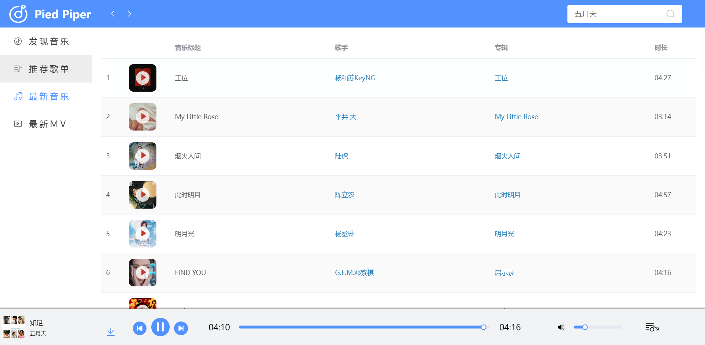
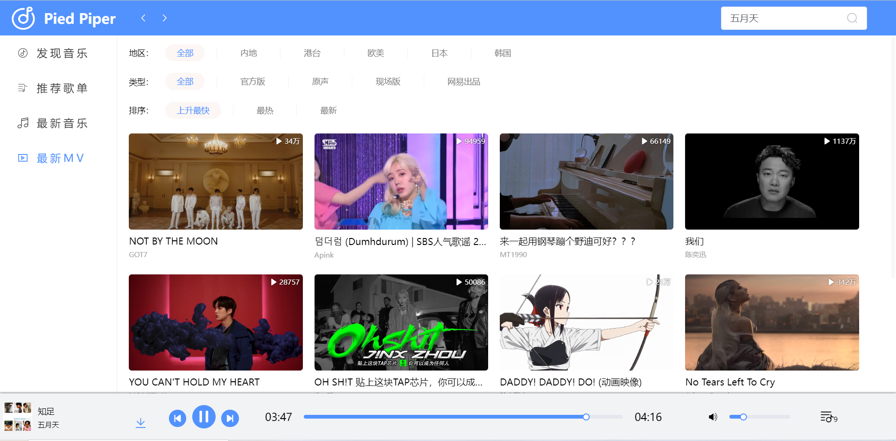
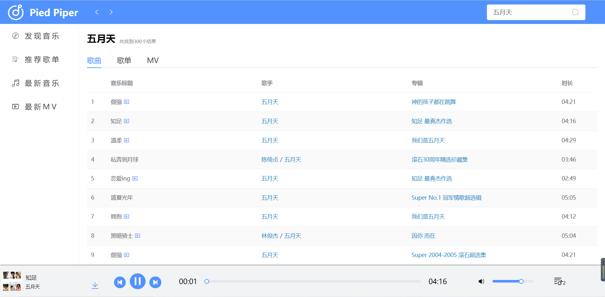
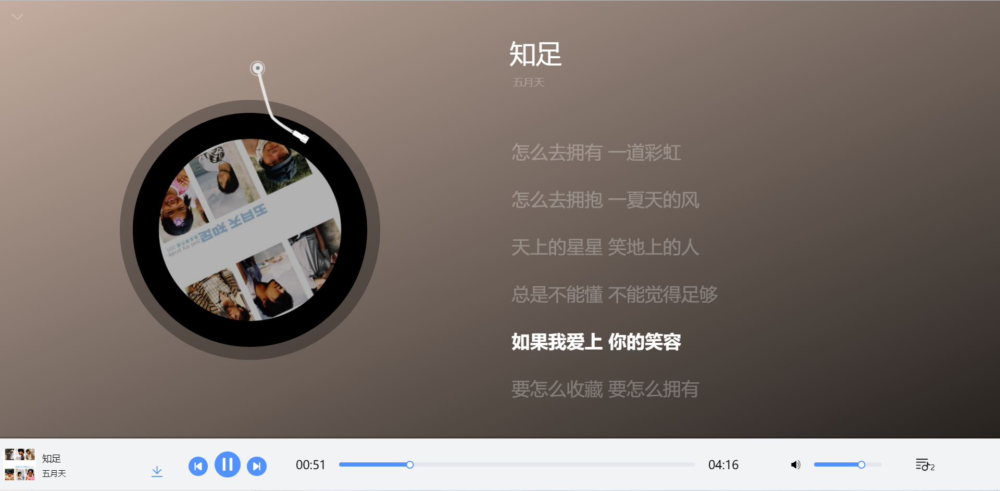
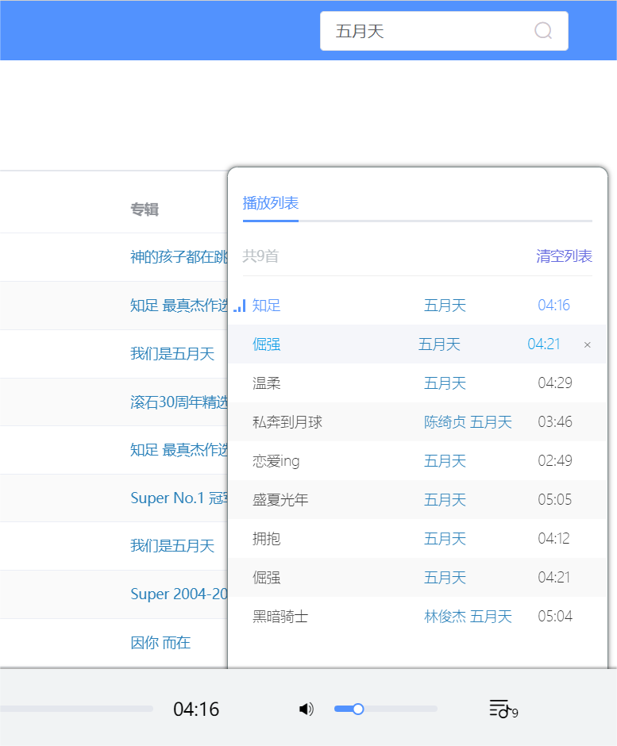
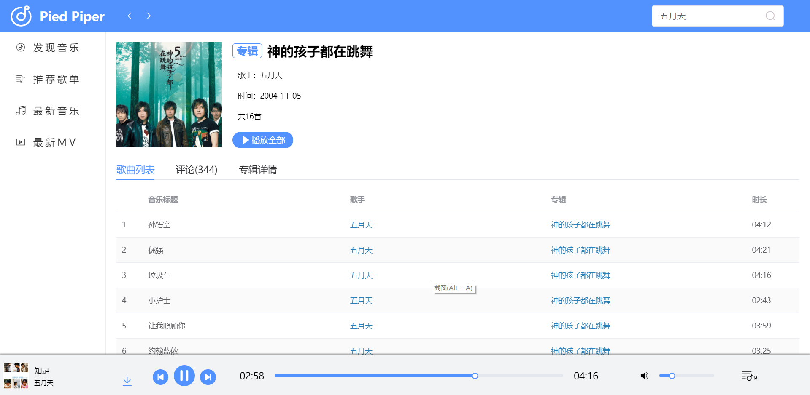

# vue-piedpiper-music
# Pied Piper音乐播放器

## 💬前言
一款在线音乐播放器，是我个人练手的小项目，使用Vue2全家桶编写，部分UI风格参考**网易云音乐**

> 请使用PC访问 **[在线演示](http://piedpiper.3vhost.work)** (最好用Chrome)

## 💪网易云音乐NodeJS版API
> 感谢开源项目 *NeteaseCloudMusicApi* 提供的支持 
> [Github地址](https://github.com/Binaryify/NeteaseCloudMusicApi) 
> [使用文档](https://binaryify.github.io/NeteaseCloudMusicApi/#/)

## 👉技术栈
- Vue
- Vue Cli
- Vue Router
- Vuex
- ElementUI
- Axios

## 📃开发详情
● 负责项目的构架和开发，使用Vue Cli快速搭建开发环境
● 使用Vue+Elemnet UI进行后台管理系统的开发和样式布局
● 使用HTML5的audio和video实现项目的视频和音频播放
● 使用Vue Router实现页面之间的路由切换并使用路由守卫实现跳转前的验证
● 使用Vuex实现不同组件间的数据传输和方法调用
● 使用github的开源接口并对该接口进行代理，使用axios进行封装并调用接口数据进行页面渲染

## 🚩运行项目
#### 本项目
    # 克隆项目到本地
    Github项目地址：https://github.com/APS-47/vue-piedpiper-music.git
    Gitee项目地址：https://gitee.com/aps-47/vue-piedpiper-music.git
    # 进入项目文件夹
    cd vue-piedpiper-music

    # 安装依赖
    npm install

    # 启动项目
    npm run serve

#### 后端接口（本项目已对接口进行代理，无需再自己克隆运行api，该步骤只适用于没有代理接口的情况）
    # 克隆项目到本地
    git clone https://github.com/Binaryify/NeteaseCloudMusicApi.git

    # 进入项目文件夹
    cd NeteaseCloudMusicApi

    # 安装依赖
    npm install

    # 启动项目（默认3000端口）
    node app.js

## 🚀功能列表
- [x] 音乐播放/暂停/下一首/上一首
- [x] 进度条控制
- [x] 音量调节
- [x] 发现音乐
- [x] 推荐歌单
- [x] 最新音乐
- [x] 推荐MV
- [x] MV播放
- [x] 自动切换下一首
- [x] 列表循环播放
- [x] 播放列表
- [x] 模糊搜索
- [x] 热搜榜
- [x] 搜索历史
- [x] 歌词滚动
- [x] 歌单/专辑/歌手详情
- [x] 查看评论
- [x] 下载音乐

## 💻部分页面截图

**发现音乐** 

**推荐歌单** 

**最新音乐** 

**最新MV** 

**搜索结果** 

**歌词详情** 

**播放列表** 

**MV详情** 

**歌手详情** 

**热搜榜与搜索历史**

**歌单详情**

**专辑详情**

## 📆历史版本
#### V1.0.0 (2022年9月12日)
- 正式版发布

## 📣结语
本项目音视频文件来自各网站接口，不会修改任何音视频文件。

**正常使用请选择[网易云音乐官方客户端](https://music.163.com/)**
